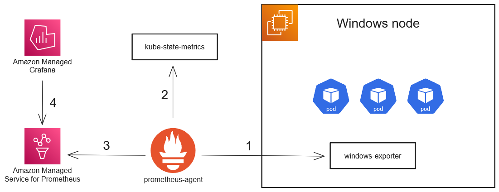

# Prometheus monitoring for Amazon EKS Windows nodes and containers.

## Introduction

Observability metrics are extremely important for both Kubernetes clusters' administrators and application developers, as they provide instantaneous and historical visibility of key performance indicators. Such metrics can be used to set up alarms, troubleshoot a system's performance, cost inefficiencies and so on.

A typical observability stack for a Kubernetes cluster usually employs a Prometheus agent or server, which will scrape metrics from cluster-level components such as _node-exporter_ and _kube-state-metrics_, and user applications alike. These metrics can then be integrated into an analytics and visualization solution, such as Grafana.

This post will show how to collect and query metrics from Windows nodes and workloads running on EKS.

## Solution overview



1. _prometheus-agent_ collects container and host node metrics - such as CPU and memory usage - from the _windows-exporter_ HostProcess DaemonSet.
2. _kube-state-metrics_ are also collected in order to map pod and container names to their  _container id_.
3. _prometheus-agent_ periodically pushes the collected metrics to a workspace in [Amazon Managed Service for Prometheus](https://aws.amazon.com/prometheus/).
4. [Amazon Managed Grafana](https://aws.amazon.com/grafana/) provides the ability to create visualizations and alarms from the collected metrics.

**Prerequisites and assumptions:**

- You have an [Amazon EKS Cluster](https://docs.aws.amazon.com/eks/latest/userguide/create-cluster.html) running **version 1.25** or newer with Windows nodes.
- The cluster container runtime is _containerd_ **version 1.6.x** or newer.
- `kubectl` configured
- Helm CLI version 3.0 or higher installed.

## Walkthrough

This walkthrough include steps and links to documentation on how to set up Prometheus metrics collection and visualization in an EKS cluster. If you already have a similar stack configured, skip to step _3_. Steps _4_ and _5_ contain sample queries for monitoring windows instance and containers metrics.

1. Create an AMP ([Amazon Managed Service for Prometheus](https://aws.amazon.com/prometheus/)) workspace and start ingesting Prometheus metrics.

    1.1. If you have not created an AMP workspace yet, follow this [documentation](https://docs.aws.amazon.com/prometheus/latest/userguide/AMP-onboard-create-workspace.html) to create it using the AWS Console.

    1.2. To install _prometheus-agent_ and configure it to push metrics to your AMP workspace, follow this [documentation](https://docs.aws.amazon.com/prometheus/latest/userguide/AMP-onboard-ingest-metrics.html).

    1.3. Wait until _prometheus-agent_ is running. You can enter the following terminal command to check its status. Replace `prometheus-agent-namespace` with the name of the namespace chosen during step _1.2_.

    ```
    kubectl get pod -n prometheus-agent-namespace
    ```

    1.4. Enter the following command to install _kube-state-metrics_:

    ```
    helm install kube-state-metrics prometheus-community/kube-state-metrics -n kube-system
    ```

2. Create and configure an [Amazon Managed Grafana](https://aws.amazon.com/grafana/) workspace.

    2.1. If you have not created an Amazon Managed Grafana workspace yet, do so by following the steps in the following [documentation](https://docs.aws.amazon.com/grafana/latest/userguide/getting-started-with-AMG.html).

    2.2. Configure the AMP workspace created in step _1_ as a data source of your Grafana workspace, according to this [documentation](https://docs.aws.amazon.com/grafana/latest/userguide/AMP-adding-AWS-config.html).

3. Install the _windows-exporter_ DaemonSet in your cluster.

    3.1. Create a namespace called `windows-monitoring`:

    ```bash
    kubectl create namespace windows-monitoring
    ```

    3.2. Create a file containing the code below and save it as `windows-exporter.yaml`:

    <!-- TODO: map initContainer image for different windows server versions -->

    ```yaml
    apiVersion: apps/v1
    kind: DaemonSet
    metadata:
        name: windows-exporter
        namespace: monitoring
        labels:
            app: windows-exporter
    spec:
        selector:
            matchLabels:
                app: windows-exporter
        template:
            metadata:
                labels:
                    app: windows-exporter
                annotations:
                    prometheus.io/scrape: "true"
                    prometheus.io/scheme: http
                    prometheus.io/path: /metrics
                    prometheus.io/port: "9182"
            spec:
                securityContext:
                    windowsOptions:
                        hostProcess: true
                        runAsUserName: NT AUTHORITY\system
                hostNetwork: true
                initContainers:
                    - name: configure-firewall
                    image: mcr.microsoft.com/powershell:lts-nanoserver-1809
                    command:
                        - powershell
                    args:
                        - New-NetFirewallRule
                        - -DisplayName
                        - '''windows-exporter'''
                        - -Direction
                        - inbound
                        - -Profile
                        - Any
                        - -Action
                        - Allow
                        - -LocalPort
                        - "9182"
                        - -Protocol
                        - TCP
                containers:
                    - args:
                        - --config.file=%CONTAINER_SANDBOX_MOUNT_POINT%/config.yml
                    name: windows-exporter
                    image: ghcr.io/prometheus-community/windows-exporter:latest
                    imagePullPolicy: Always
                    ports:
                        - containerPort: 9182
                        hostPort: 9182
                        name: http
                    volumeMounts:
                        - name: windows-exporter-config
                        mountPath: /config.yml
                        subPath: config.yml
                nodeSelector:
                    kubernetes.io/os: windows
                volumes:
                    - name: windows-exporter-config
                    configMap:
                        name: windows-exporter-config
    ---
    kind: ConfigMap
    apiVersion: v1
    metadata:
        name: windows-exporter-config
        namespace: monitoring
        labels:
            app: windows-exporter
    data:
        config.yml: |
            collectors:
                enabled: '[defaults],container'
            collector:
                service:
                    services-where: "Name='containerd' or Name='kubelet'"
    ```

    3.3. Deploy the _windows-exporter_ DaemonSet using the following command:

    ```bash
    kubectl apply -f windows-exporter.yaml
    ```

4. Visualize the CPU usage of your windows instances.

    <!-- TODO: add images for steps 4 and 5 -->

    4.1. Browse to the Grafana instance you provisioned during step _2.1_ and create a new dashboard.

    4.2. Add a new visualization and select the AMP data source you created during step _2.2_.
    
    4.3. Add the following PromQL query to graph the CPU usage of your windows instances.
    
    ```
    sum by (instance) (rate(windows_cpu_time_total{mode!="idle"}[$__rate_interval])) / count by (instance) (rate(windows_cpu_time_total{cluster="$cluster",mode="idle"}[$__rate_interval]))
    ```

    4.4. In the panel options, select `Percent (0-1)` as the unit.

5. Visualize the CPU usage of your windows containers.

    5.1. Browse to the Grafana instance you provisioned during step _2.1_ and create a new dashboard.

    5.2. Add a new visualization and select the AMP data source you created during step _2.2_. 

    5.3. Add the following PromQL query to visualize the CPU usage of your windows containers.

    ```
    kube_pod_container_info{} * on(container_id) group_left rate(windows_container_cpu_usage_seconds_total{}[$__rate_interval])
    ```

    The query above shows how to enrich _windows-exporter_ container metrics - such as `windows_container_cpu_usage_seconds_total` - with kubernetes metadata by joining with the `kube_pod_container_info` metric from _kube-state-metrics_ on the `container_id` label. `kube_pod_container_info` contains other labels such as `pod`, `namespace` and `container`, which can be used to filter specific containers and to label the visualization.

## Conclusion

In this post, we showed the steps required to set up Prometheus metrics collection for Windows workloads on EKS clusters and visualization using [Amazon Managed Service for Prometheus](https://aws.amazon.com/prometheus/) and [Amazon Managed Grafana](https://aws.amazon.com/grafana/). _windows-exporter_ metrics were also enriched with metadata from _kube-state-metrics_ so containers can be mapped to individual pods. Although we only provided samples for container and node CPU metrics, many more metrics and collectors are available in the windows-exporter [repository](https://github.com/prometheus-community/windows_exporter#collectors) 

